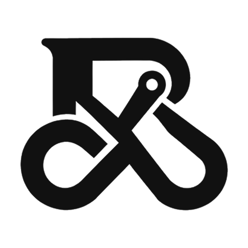

  <picture>
    <source media="(prefers-color-scheme: dark)" srcset="brand/robotex-mark-dark.png">
    
  </picture>

# RoboteX Labs Inc.

RoboteX investigates robotics and neurotechnology, including assistive concepts, sensing, adaptive control and simulation. Public work should distinguish software or simulated results from physical-device, human-use or clinical validation.

## Open by design

**We plan to publish our robotic simulations and interface models openly.** We have not published any yet. When we do, they will carry open licences (usually Apache-2.0 for code and CC BY 4.0 for written material), so public-interest teams can use them, check how they work and adapt them freely. Open work is easier to trust, because anyone can see exactly how a result is produced.

**Our own work, and only ours.** Everything we publish here will be our own, built from public data and synthetic examples. It will never include client data, client projects, or anyone else's confidential information or intellectual property.

Contact: info@robotexlabs.ca | Website: https://robotexlabs.ca/
